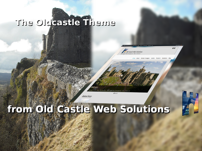

# Oldcastle
Oldcastle is a fully responsive theme for Wordpress. It is based on our base theme, Qohelet, which, in turn, has been built on the shoulders of giants, utilizing a number of other technologies, such as: 1. The Quark starter theme by Anthony Horton. 2. Quark is in turn built upon Underscores by Automattix. 3. Quark utilizes Normalize, Modernizr and Options Framework. 4. Many other smaller amounts of other technologies have been incorporated, so that I did not re-invent the wheel.

